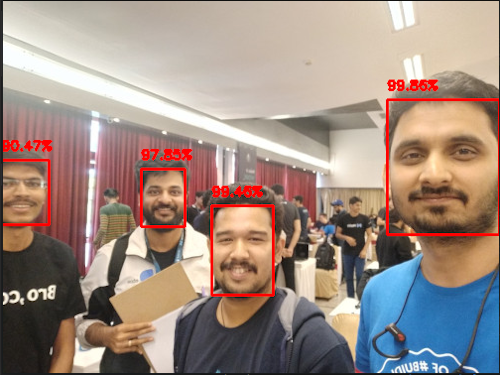
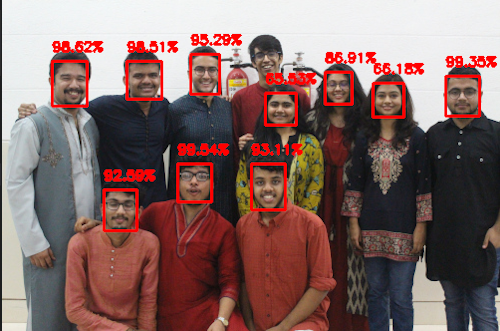
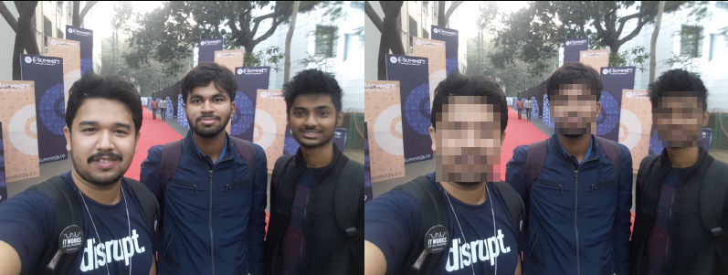

<h1 align="center">Computer Vision Projects</h1>

    </img>
    </img>

A collection of Computer Vision related projects created primarily using OpenCV

***

## List of projects in this repository:
1. [Face Detection with OpenCV & Deep Learning](#face-detection-with-opencv-&-deep-learning)
2. [Face Blurring](#face-blurring)
3. [Document Scanner](#document-scanner)
4. [OMR Test Grader](#omr-test-grader)
5. [Ball Tracker](#ball-tracker)
6. [Object Size Measurement](#object-size-measurement)
7. [Facial Landmarks Detector](#facial-landmarks-detector)
8. [Eye Blink Detector](#eye-blink-detector)
9. [Drowsiness Detector](#drowsiness-detector)
10. [Image Classification](#image-classification)

## Face Detection with OpenCV & Deep Learning

__Overview:__

OpenCV ships out-of-the-box with pre-trained [Haar cascades](https://docs.opencv.org/3.4/db/d28/tutorial_cascade_classifier.html) that can be used for face detection in general. But for this app, we use a pre-trained __deep learning-based face detector model__ (built using Caffe).

For using OpenCV's Deep Neuram Network [`dnn`] module with Caffe Models we need 2 file:
- `.prototxt` file defines the model architecture
- `.caffemodel` contains the weights for the actual layers

These files can be found [here](https://github.com/tezansahu/Computer_Vision_Projects/tree/master/1.%20Face%20Detection%20with%20OpenCV%20and%20Deep%20Learning/caffe-model)

__Code:__

- [Code for detecting faces in a picture](1_Face_Detection_with_OpenCV_and_Deep_Learning/detect_faces.py)
- [Code for detecting faces in a video](1_Face_Detection_with_OpenCV_and_Deep_Learning/detect_faces_video.py)

__Results:__

## Face Blurring

__Overview:__

For this project, we use the same Caffe model for detecting faces as done in the previous project & once the Region of Interest (ROI) is detected, we perform a blur operation on it & superimpose it on the original image.

We provide an option to perform 2 types of blurring (while running the script):
- Gaussian Blur (the size of Gaussian kernel can be specified)
- Pixelated Blur (the size of pixelated boxes can be specified)

__Code:__

[Code for blurring faces in an image](2_Face_Blurring/face_blur.py)

__Results:__

- __Gaussian Blur:__

  
  

- __Pixelated Blur:__

  
  

## Document Scanner

## OMR Test Grader

## Ball Tracker

## Object Size Measurement

## Facial Landmarks Detector

## Eye Blink Detector

## Drowsiness Detector

## Image Classification

***

Created with :heart: by <a href="https://www.linkedin.com/in/tezan-sahu/">Tezan Sahu</a>

